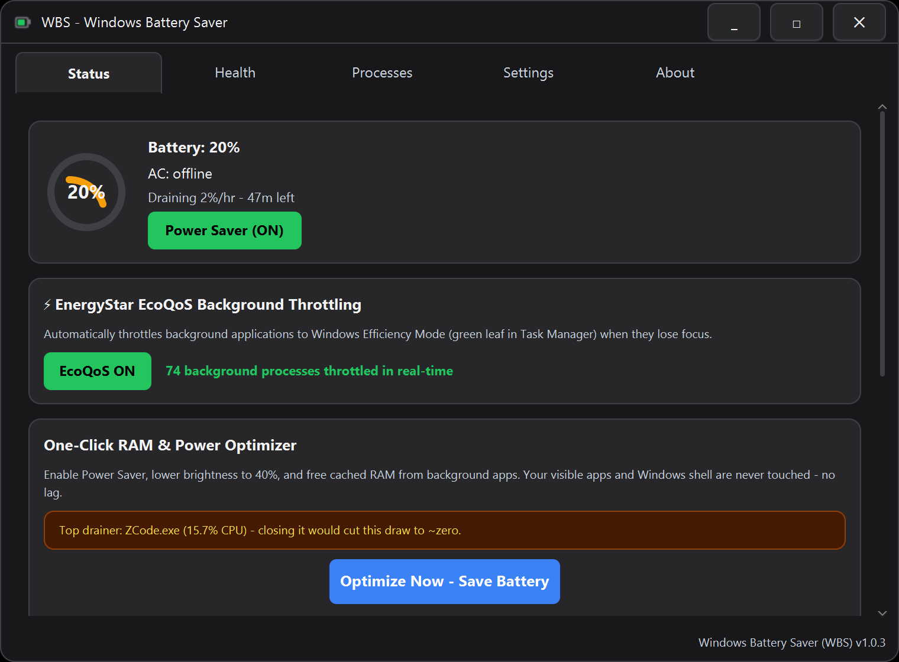

<div align="center">


# ⚡ Windows Battery Saver (WBS)

**Real battery saving for Windows 10/11 — no OEM drivers, no bloat, no telemetry.**

EcoQoS Efficiency Mode throttling • Auto Power Saver • Battery health tracking • One-click optimizer

[](https://github.com/iishanmakkar/WinBatterySaver/releases/latest)
[](https://github.com/iishanmakkar/WinBatterySaver/actions/workflows/ci.yml)


**[⬇️ Download the latest installer](https://github.com/iishanmakkar/WinBatterySaver/releases/latest)** — free, MIT licensed, works on Dell / HP / Lenovo / Asus / Acer / any laptop

</div>

---



## Why WBS?

Windows already has power plans. OEMs (Dell Power Manager, Lenovo Vantage…) ship their own tools — but only for *their* hardware. **WBS brings the same class of battery management to every laptop**, using only standard Windows APIs:

- 🔋 **Real Efficiency Mode for background apps** — WBS applies Microsoft's [EcoQoS](https://learn.microsoft.com/en-us/windows/win32/procthread/quality-of-service) (the green leaf in Task Manager) to background processes automatically. Not fake "RAM boosting" — actual CPU efficiency states.
- 🪫 **Auto Power Saver at low battery** — at your threshold (default 20%), WBS enables Power Saver, dims the screen, and drops background apps into Efficiency Mode *before* your laptop dies. One-shot per discharge, re-arms automatically.
- 🔌 **Smart plug/unplug automation** — unplugged? Power Saver + brightness 40%. Plugged back in? Everything restores.
- 👁️ **Never touches what you're using** — visible windows, the foreground app and its process tree, plus all shell/system processes are exempt. Background throttling that only throttles *background*.
- 📊 **Battery health & cycle count** — design vs. full-charge capacity, wear %, cycle count, live health bar.
- 📉 **Drain analytics** — live history chart (1h–7d), %/hour drain rate, sudden-drop detection with the top drainer named.
- 🧹 **One-click optimizer** — Power Saver + brightness + background RAM trim, guaranteed lag-free.
- ⏱️ **Idle dimming** — screen dims after configurable idle minutes, restores instantly.
- 🔔 **Charge-limit reminders** — toast at your limit (default 80%) to protect long-term battery health.
- 🖥️ **Full tray app** — starts minimized, global hotkey (Ctrl+Alt+B), single instance, Windows 11 style UI, dark & light themes.

<br clear="all">

---

## 📥 Install

1. **Download** from the [latest release](https://github.com/iishanmakkar/WinBatterySaver/releases/latest):
   - **`WindowsBatterySaver-x.y.z.msi`** — plain Windows Installer package (recommended; installs even on PCs where Smart App Control blocks unsigned .exe launchers)
   - `WindowsBatterySaver-x.y.z.exe` — setup wizard with the same payload
   - `WindowsBatterySaver-x.y.z-portable-win64.zip` — no install, just extract and run

   Direct links (v1.0.3): [.msi](https://github.com/iishanmakkar/WinBatterySaver/raw/download/WindowsBatterySaver-1.0.3.msi) · [installer .exe](https://github.com/iishanmakkar/WinBatterySaver/raw/download/WindowsBatterySaver-1.0.3.exe) · [portable .zip](https://github.com/iishanmakkar/WinBatterySaver/raw/download/WindowsBatterySaver-1.0.3-portable-win64.zip) · [SHA256SUMS.txt](https://github.com/iishanmakkar/WinBatterySaver/raw/download/SHA256SUMS.txt)
2. Run the MSI (or exe). Windows SmartScreen may ask for confirmation on first run — the app is code-signed with a free self-signed certificate, so the publisher is verifiable but not yet known to Microsoft. Click **More info → Run anyway**. Everything is open source — build it yourself if you prefer.

   <details><summary><i>"Blocked by Device Guard / Application Control policy" (Windows 11 Smart App Control)</i></summary>
   On PCs where <b>Smart App Control (SAC)</b> is <b>On</b>, Windows hard-blocks <i>unsigned</i> .exe launchers — with no "run anyway" option. WBS gives you three ways around it:<br><br>
   • <b>Use the .msi</b> — Windows Installer (msiexec, a Microsoft-signed component) processes our signed MSI even where unsigned .exe files are blocked.<br>
   • <b>Portable + any installed Java 17+</b>: extract the .zip and launch the jar with a CA-signed JDK (e.g. free <a href="https://adoptium.net">Temurin 17</a>) — SAC allows Microsoft-recognized CA-signed executables:<br>
   <code>"C:\Program Files\Eclipse Adoptium\jdk-17\bin\java.exe" --enable-native-access=ALL-UNNAMED -jar WindowsBatterySaver\app\WindowsBatterySaver.jar</code><br>
   • Turn SAC off (Settings → Privacy & security → Windows Security → App & browser control → Smart App Control → Off). Note: SAC cannot be turned back on without reinstalling Windows — Microsoft Defender stays on either way.<br><br>
   Check your SAC state: <code>(Get-MpComputerStatus).SmartAppControlState</code>. The permanent project fix — a trusted certificate-authority signature — is planned (see docs/signing.md).
   </details>

3. That's it. WBS lives in your system tray. **Auto-start with Windows is configured automatically** — no account, no subscription, no upsell.

> **Upgrading:** just run the new installer — it updates in place and keeps your settings. Uninstall anytime from Settings → Apps.

---

## 🧠 How it works (no magic)

| Feature | Mechanism |
|---|---|
| Efficiency Mode | Windows **EcoQoS** via `SetProcessInformation` (JNA) — the same API Task Manager uses |
| Power plans | `powercfg` + `PowerGetActiveScheme`; verifies every switch, restores your original plan |
| Battery data | `GetSystemPowerStatus` + `powercfg /batteryreport` parsing (multi-battery aware) |
| Brightness | WMI `WmiMonitorBrightnessMethods` — cross-OEM, 3s timeout, graceful fallback |
| Exemptions | `EnumWindows` visibility check + foreground process-tree walk — visible apps are never throttled |
| Auto-start | Self-healing `HKCU\...\Run` registration that survives app updates and moves |

**What WBS will never do:** require admin for basic use, install drivers or services, run anything at startup besides itself, phone home (the update check is manual-only), or show ads.

<details>
<summary><b>FAQ</b></summary>

**Does it work on my Dell/HP/Lenovo/Asus?** Yes — WBS uses standard Windows APIs, not OEM SDKs. Brightness control needs a WMI-capable panel (virtually all laptops); everything else works everywhere.

**Does it need Administrator?** No. EcoQoS covers all your normal-user processes without it. An optional *Restart as Administrator* in Settings extends throttling to elevated/background-service processes too.

**Will it slow my laptop down?** Visible/foreground apps are never touched. Background apps get lower CPU *efficiency* states (that's the point) and return to full speed the moment you focus them.

**Is the RAM optimizer safe?** It trims background processes only — never dwm/explorer/shell, never your foreground app, never anything with a visible window.

**Uninstalling?** Settings → Apps → WindowsBatterySaver. WBS removes its autostart entry and un-throttles everything it touched on exit.
</details>

---

## 🛠️ Build from source

```powershell
git clone https://github.com/iishanmakkar/WinBatterySaver.git
cd WinBatterySaver
gradlew test          # 36 tests (Windows)
gradlew releaseBundle # build/dist → signed installer .exe + portable zip + SHA256
```

Requirements: Windows 10/11, JDK 17+ (code targets 17, ships with its own bundled JRE), WiX 3.14 for the installer. Code signing uses the free persistent cert in `packaging/sign-cert.ps1`.

<details>
<summary>Project layout</summary>

```
src/main/java/com/batterysaver/
├── Main.java               # app wiring, tray, pollers, autostart self-heal
├── interop/                # JNA: Kernel32, User32, PowrProf, Shell32
├── service/                # battery, EcoQoS, power plan, brightness, health, hotkey…
├── view/                   # ExpandedView (tabs), TrayManager, CustomTitleBar, chart
├── viewmodel/              # MainViewModel — state + 5s poll pipeline
└── util/                   # AppExe, ProcessTree, VisibleWindows, elevation…
```
</details>

---

## 🤝 Contributing

Issues and PRs welcome! Good first contributions: translations, more OEM-specific tips for the Health tab, installer polish. Please run `gradlew test` before submitting.

## ⭐ Support

If WBS saves your battery, **star the repo** — it helps other laptop users find it.

<a href="https://github.com/iishanmakkar/WinBatterySaver/stargazers"></a>

## 📄 License

[MIT](LICENSE) — free for personal and commercial use. Built with JDK 17+, JavaFX 21, JNA 5.14.
