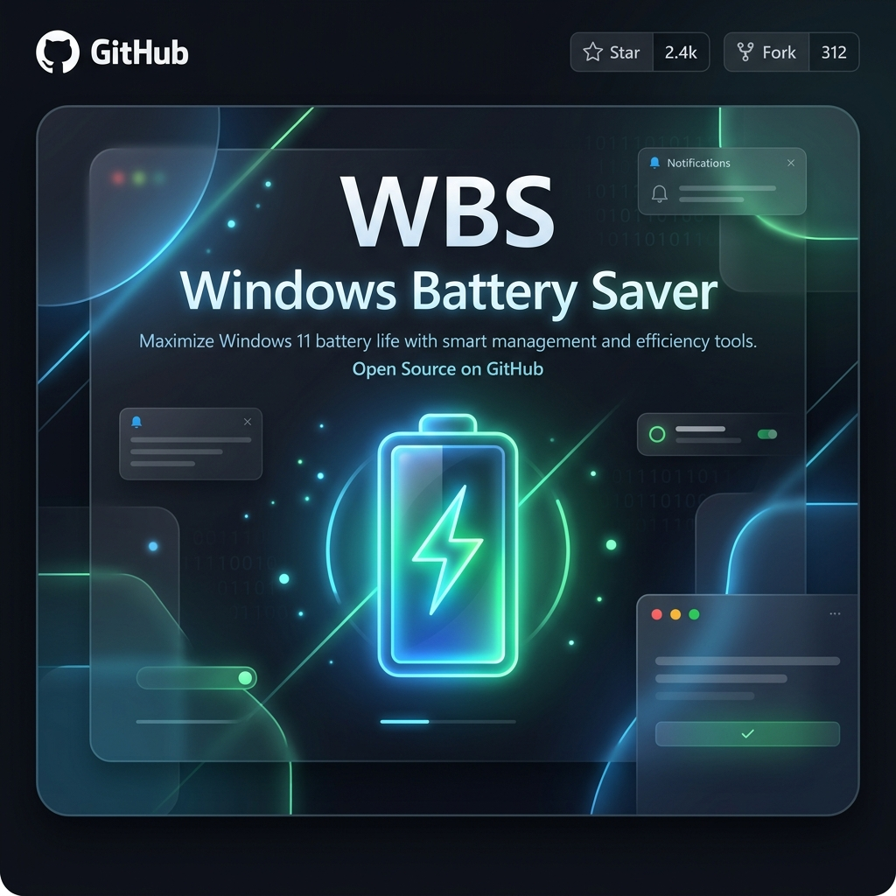
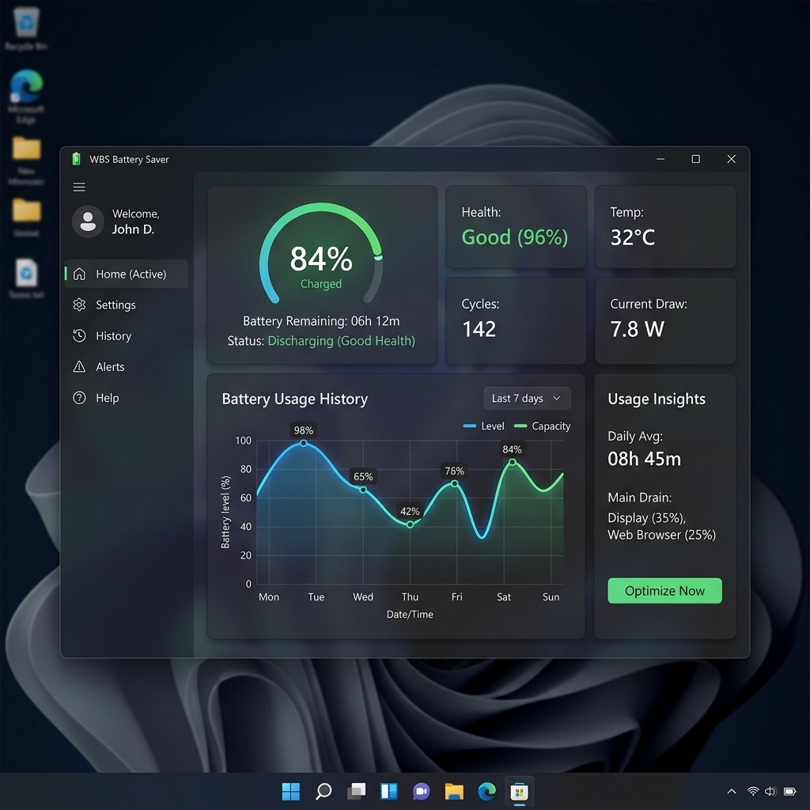

<div align="center">
  
  
  # WBS - Windows Battery Saver ⚡💻
  
  **Cross-OEM, Lightweight & Intelligent Laptop Battery Saver for Windows 11 & 10**

  [](https://opensource.org/licenses/MIT)
  [](https://microsoft.com/windows)
  [](https://openjdk.java.net/)
  [](https://gradle.org)

</div>

WBS (Windows Battery Saver) is an open-source, production-ready utility designed to maximize laptop battery life across all major brands (**Dell, HP, Lenovo, Asus, Acer, Surface, MSI, Razer, Samsung**). It requires no proprietary vendor drivers, running natively via standard Windows APIs (`Kernel32`, `User32`, `powercfg`, and `WMI`).

---

## 📸 Application Preview

<div align="center">
  
  <br>
  <i>Modern Windows 11 Fluent UI with Dark Mode, Glassmorphism, and Battery History Line Chart</i>
</div>

---

## 📑 Table of Contents

- [Key Features](#-key-features)
- [Building & Running](#%EF%B8%8F-building--running)
- [Architecture](#%EF%B8%8F-architecture)
- [License](#-license)

---

## 🌟 Key Features

- **⚡ EnergyStar EcoQoS Throttling**: Automatically applies Windows **Efficiency Mode (EcoQoS)** to background processes when they lose focus. Reduces background CPU power consumption by 15%–30% without slowing active foreground applications.
- **🎨 Windows 11 Fluent UI**: Modern interface with seamless **Dark** and **Light** themes, sleek TabPane navigation, custom scrollbars, and high-contrast typography.
- **🧹 One-Click RAM & Power Optimizer**: Clears cached RAM (`EmptyWorkingSet`) to reduce background memory/disk paging and lowers display brightness.
- **🔋 Battery Health & Cycle Tracking**: Reads design capacity, full charge capacity, wear %, and charge cycles directly from system hardware.
- **📊 Adaptive History & Drain Analytics**: Live, interactive battery history line chart tracking battery percentage trends over 1h, 2h, 6h, 24h, or 7d.
- **⚡ Smart Power Saver Fallback**: Automatically creates and restores Windows Power Saver schemes, or applies software-based throttling on Modern Standby / GPO-restricted laptops.
- **🛡️ Charge Limit Reminders**: Notifies when battery reaches the recommended 80% charge limit to prevent battery degradation and heat stress.
- **🚀 Auto-Start & Tray Operations**: Automatically starts minimized to the Windows system tray (`HKCU\Software\Microsoft\Windows\CurrentVersion\Run`).

---

## 💾 Installation

1. Go to the [Releases](https://github.com/iishanmakkar/WinBatterySaver/releases) page and download the latest `.exe` installer.
2. Double-click the installer to run it.
> **Note**: Because this is a free, open-source tool signed with a self-signed certificate, Windows SmartScreen may show a blue "Windows protected your PC" warning. This is perfectly normal. Just click **More info** -> **Run anyway** to proceed with the installation.
3. Once installed, the app will run minimized in your system tray (bottom right corner).

---

## 🛠️ Building & Running

### Requirements
- **OS**: Windows 10 (1709+) or Windows 11
- **JDK**: Java 17+ (configured for Java 17 / OpenJFX 17.0.6)
- **Build System**: Gradle (wrapper included)

### Build Executable & Run
```powershell
# Clone repository
git clone https://github.com/iishanmakkar/WinBatterySaver.git
cd BatterySaver

# Compile and run unit tests
.\gradlew.bat test

# Build and launch application
.\gradlew.bat run

# Build standalone JAR
.\gradlew.bat jar
```

---

## 🏗️ Architecture

```text
com.batterysaver
 ├── constants/       # AppConstants & Configuration Defaults
 ├── interop/         # JNA Native Win32 API Bindings (Kernel32, User32, PowerThrottling)
 ├── model/           # Battery Status & Power Plan Models
 ├── service/         # Core Services (EcoQoS, Health, Optimizer, Brightness, Hotkey)
 ├── util/            # PortableMode & SingleInstanceGuard
 ├── view/            # JavaFX Views (ExpandedView, CompactView, TrayManager, Chart)
 └── viewmodel/       # Reactive MainViewModel with FX Property Bindings
```

---

## ☕ Support
Created by [Ishan Makkar](https://buymeacoffee.com/iishanmakkar). If you find this project helpful, consider buying me a coffee!

---

## 📄 License
Released under the [MIT License](LICENSE). Free for personal and commercial use.

---

## ?? Contributing
We welcome contributions from the community! If you have suggestions for new features, bug fixes, or improvements, please feel free to:

1. Fork the repository.
2. Create a new branch (git checkout -b feature/your-feature-name).
3. Make your changes.
4. Commit your changes (git commit -m 'Add new feature').
5. Push to the branch (git push origin feature/your-feature-name).
6. Open a Pull Request.

